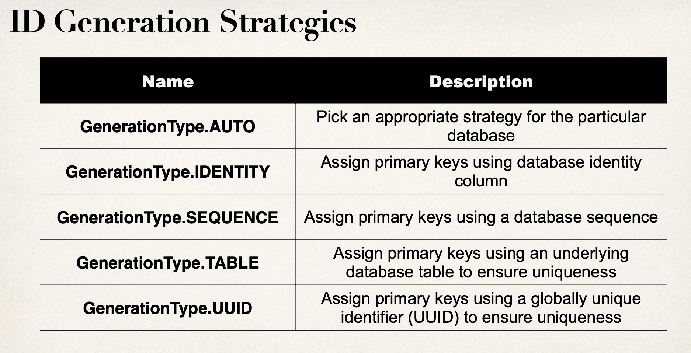
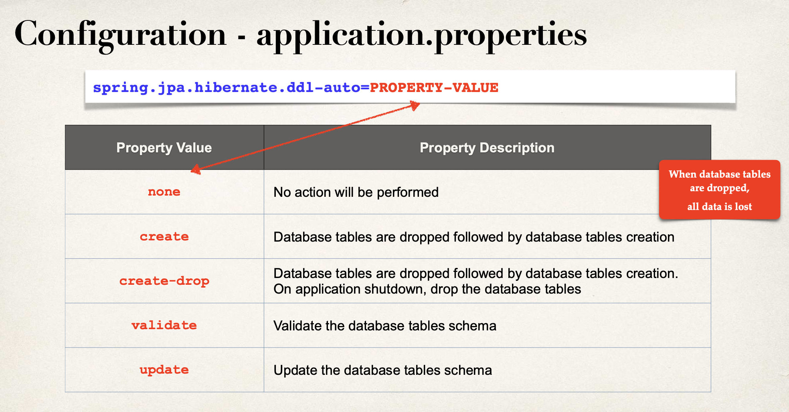
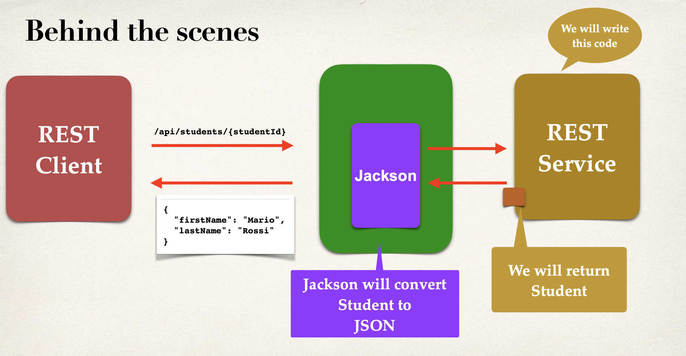

# SPRING_LEARNING

This repository documents my journey of learning Spring and Spring Boot. It includes concepts, explanations, and practical tips related to Maven, Spring Boot annotations, configurations, dependency injection, bean lifecycle, and more.

---

## What is Maven?

**Apache Maven** is a powerful build automation and project management tool primarily used for Java projects.

### What Maven Does:

1. **Builds Your Project** – `mvn compile`, `mvn package`
2. **Manages Dependencies** – via `pom.xml`
3. **Runs Tests** – `mvn test`
4. **Packages Application** – into `.jar` or `.war` files
5. **Deployment** – if required, via `mvn deploy`

### Common Maven Commands

| Command               | Description                           |
| --------------------- | ------------------------------------- |
| `mvn clean`           | Deletes the `target/` directory       |
| `mvn compile`         | Compiles the source code              |
| `mvn test`            | Runs the test cases                   |
| `mvn package`         | Packages the app into a `.jar`/`.war` |
| `mvn spring-boot:run` | Runs a Spring Boot app directly       |

### About `mvnw` Files

These wrapper files are used to ensure a consistent Maven version across all systems. You can delete them if Maven is already installed locally.

---

## Spring Boot Starter Parent

Using the Spring Boot Starter Parent helps in managing dependencies more efficiently.

- Provides default plugin versions
- Inherits dependency versions (no need to specify them individually)
- Manages Java version, encoding, and more

---

## Actuator

Spring Boot Actuator offers production-ready features to help monitor and manage applications.

### Features:

- Health Checks
- Metrics Collection
- Environment & Configuration Info
- Thread Dumps
- Custom Endpoints

---

## Ways to Run a Maven Project

1. **Via Command Line (JAR Execution)**

   - `mvn package`
   - `cd target`
   - `java -jar <YourApp>.jar`

2. **Using Spring Boot Plugin**

   - `mvn spring-boot:run`

3. **Through IDE**

   - Click the green "Run" icon or use context menu: "Run as Application"

---

## General Spring Boot Configuration

### Application Info

```properties
spring.application.name=MySpringApp
info.app.version=1.0.0
info.app.description=My Spring Boot learning app
```

### Security

```properties
spring.security.user.name=admin
spring.security.user.password=admin123
spring.security.user.roles=ADMIN
```

### CORS

```properties
app.cors.allowed-origins=http://localhost:3000
app.cors.allowed-methods=GET,POST,PUT,DELETE
```

### Server

```properties
server.port=8080
server.servlet.session.timeout=15m
server.servlet.context-path=/api/projects
server.error.include-message=always
```

### Mail

```properties
spring.mail.host=smtp.gmail.com
spring.mail.port=587
spring.mail.username=your-email@gmail.com
spring.mail.password=your-password
spring.mail.properties.mail.smtp.auth=true
spring.mail.properties.mail.smtp.starttls.enable=true
```

### Profiles

```properties
spring.profiles.active=dev
```

### Logging

```properties
logging.level.root=INFO
logging.level.com.SpringBoot_Learning=DEBUG
logging.level.org.springframework.web=DEBUG
logging.file.name=SpringBoot_Learning.log
logging.file.path=/logs
logging.pattern.file=%d{yyyy-MM-dd} %p %c{1} - %m%n
logging.file.max-size=10MB
logging.file.max-history=30
logging.file.total-size-cap=1GB
logging.file.clean-history-on-start=true
```

---

## Key Spring Boot Annotations

### `@SpringBootApplication`

Combines:

- `@Configuration`
- `@EnableAutoConfiguration`
- `@ComponentScan`

### `@ComponentScan`

Scans the specified packages for Spring components.

```java
@SpringBootApplication(scanBasePackages = {"com.package1", "com.package2"})
```

### Annotation Summary

| Annotation        | Purpose                          |
| ----------------- | -------------------------------- |
| `@Component`      | Generic Spring-managed component |
| `@Service`        | Business logic component         |
| `@Repository`     | Data access component            |
| `@Controller`     | MVC controller                   |
| `@RestController` | REST API controller              |

---

## Dependency Injection & Bean Management

### AutoWiring

- Spring injects dependencies into components using `@Autowired`
- Automatically detects implementations and injects accordingly

### `@Qualifier` vs `@Primary`

- Use `@Qualifier("beanName")` to specify the desired bean
- Use `@Primary` to mark a default bean (but `@Qualifier` takes precedence)

### Custom Bean Example

```java
@Component("battingCoach")
public class CricketCoach implements Coach {}
```

---

## Lazy Initialization

- Default behavior: **Eager** (at startup)
- To enable lazy loading:
  - Globally: `spring.main.lazy-initialization=true`
  - Per class: Use `@Lazy`

---

## Bean Scopes

| Scope       | Description                        | Annotation                                        |
| ----------- | ---------------------------------- | ------------------------------------------------- |
| Singleton   | Single instance per Spring context | `@Scope(ConfigurableBeanFactory.SCOPE_SINGLETON)` |
| Prototype   | New instance every time requested  | `@Scope(ConfigurableBeanFactory.SCOPE_PROTOTYPE)` |
| Request     | One per HTTP request               | `@Scope(WebApplicationContext.SCOPE_REQUEST)`     |
| Session     | One per HTTP session               | `@Scope(WebApplicationContext.SCOPE_SESSION)`     |
| Application | One per application lifecycle      | `@Scope(WebApplicationContext.SCOPE_APPLICATION)` |

---

## Bean Lifecycle

Lifecycle Phases:

1. Instantiation (Constructor)
2. Dependency Injection
3. `@PostConstruct`
4. `afterPropertiesSet()` (if using `InitializingBean`)
5. Bean ready to use
6. `@PreDestroy`
7. `destroy()` (if using `DisposableBean`)

> **Note:** `@PreDestroy` and `destroy()` are not called for **prototype** beans. You must manage their cleanup manually.

---

## Bean Configuration

If a class is not marked with `@Component`, you can still register it as a bean manually using a configuration class:

```java
@Configuration
public class AppConfig {
    @Bean
    public MyService myService() {
        return new MyService();
    }
}
```

This allows Spring to manage and inject it wherever required.

## JPA & Hibernate Overview

### What is JPA (Java Persistence API)?

**JPA** is a **specification** (set of rules/interfaces) for **Object-Relational Mapping (ORM)** in Java. It provides a standard way to map Java objects to relational database tables.

#### Key Features of JPA:

1. Defines how Java objects are mapped to DB tables
2. Part of **Java EE / Jakarta EE**
3. Provides **interfaces only** – no implementation
4. Requires a **JPA provider** (like Hibernate) for actual DB operations

---

### What is Hibernate?

**Hibernate** is the **most widely used JPA provider**. It’s an ORM framework that implements JPA and adds extra features.

#### Key Features of Hibernate:

1. Implements JPA interfaces + adds advanced features
2. Handles all JDBC boilerplate code
3. Supports caching, lazy loading, dirty checking
4. Works with various databases: MySQL, PostgreSQL, H2, Oracle, etc.

---

### JPA/Hibernate Lifecycle

1. Define entity class using `@Entity` annotation
2. Spring Boot auto-configures the **EntityManager**
3. Interact using **Repository interfaces** (e.g. `JpaRepository`)
4. Hibernate handles SQL queries behind the scenes

---

### Additional Features Provided by Hibernate

| Feature                        | Description                                   |
| ------------------------------ | --------------------------------------------- |
| HQL (Hibernate Query Language) | Object-oriented query language similar to SQL |
| Second-Level Cache             | Speeds up performance using caching           |
| Auditing Support               | Tracks created/updated timestamps, etc.       |
| Custom Fetch Strategies        | Fine-tuned control over how data is retrieved |

---

With **Spring Boot**, integrating JPA & Hibernate becomes super simple – just define your entities and repositories, and Spring Boot + Hibernate take care of the rest!

Hibernate uses JDBC on the top to communicate with Databases.



---

## EntityManager vs JpaRepository

### JpaRepository

- Provides commonly used **CRUD operations** out of the box.
- Minimizes boilerplate and simplifies development.
- Supports:
  - **Pagination and Sorting**
  - **Query generation** based on method names.
- Custom queries can be written using the `@Query` annotation.

**Use Case:**  
Best suited for standard data access operations where you need quick and clean integration with Spring Data JPA.

---

### EntityManager

- Offers **low-level control** over database interactions.
- Enables:
  - Writing **native SQL queries**
  - Executing **stored procedures**
  - Managing custom transactional behavior
- Directly interacts with the **JPA persistence context** and entity lifecycle.

**Use Case:**  
Ideal for complex or performance-critical scenarios that are not easily handled by higher-level abstractions like `JpaRepository`.

## What is JPQL?

JPQL is an object-oriented query language similar to SQL but operates on entities and their relationships, not directly on database tables.

It's defined as part of JPA (Java Persistence API) and is used to perform queries on the entity objects.

### Key Characteristics

1. Entity-based: JPQL queries deal with Java objects (entities) instead of raw SQL tables and columns.

2. Portable: It's database-independent, unlike native SQL.

3. Type-safe (to an extent): While not compile-time type-safe, it gives logical consistency over SQL.

4. Case-sensitive identifiers: Entity names and property names are case-sensitive.

### JPQL Clauses

| **Clause**                         | **Description**                 |
| ---------------------------------- | ------------------------------- |
| `SELECT`                           | Selects data                    |
| `FROM`                             | Specifies the entity            |
| `WHERE`                            | Filters rows                    |
| `ORDER BY`                         | Sorts the result                |
| `GROUP BY`                         | Groups the results              |
| `HAVING`                           | Filters grouped data            |
| `JOIN`                             | Performs joins between entities |
| `IN`, `LIKE`, `BETWEEN`, `IS NULL` | Used in conditional expressions |

### Limitations

1. No support for INSERT operations.

2. Limited support for complex DB-specific functions.

3. Might not match the performance of raw SQL in some complex queries.

## Typed Query in JPA

A **TypedQuery** in JPA is a type-safe version of a `Query` that ensures the result type is known at compile time. It is part of the Java Persistence API and is generally used with JPQL (Java Persistence Query Language).

### Key Points about TypedQuery

- **Type Safety**: Ensures that the result type returned from the query matches the expected type.
- **Compile-time Checking**: Helps catch errors during compilation instead of runtime.
- **Avoids Type Casting**: Eliminates the need for casting when retrieving results.
- **Better IDE Support**: Easier code navigation, auto-completion, and refactoring support.
- **Used with EntityManager**: Created using the `EntityManager.createQuery()` method.

### Syntax

```java
TypedQuery<EntityClass> query = entityManager.createQuery("SELECT e FROM EntityClass e WHERE e.property = :value", EntityClass.class);
query.setParameter("value", someValue);
List<EntityClass> resultList = query.getResultList();
```

### Example

Suppose you have an `Employee` entity:

To fetch employees with a salary above a threshold:

```java
TypedQuery<Employee> query = entityManager.createQuery(
    "SELECT e FROM Employee e WHERE e.salary > :minSalary", Employee.class
);
query.setParameter("minSalary", 50000.0);
List<Employee> employees = query.getResultList();
```

### When to Use TypedQuery

- When you want **strongly-typed results**.
- When you want to avoid runtime `ClassCastException`.
- When using **named parameters** or **dynamic queries** in JPQL.

### Comparison with Query

| Feature            | `Query` | `TypedQuery<T>` |
| ------------------ | ------- | --------------- |
| Type Safety        | No      | Yes             |
| Casting Needed     | Yes     | No              |
| Compile-time Check | No      | Yes             |

---






# @PostConstruct in Spring - Complete Guide

---

## What is `@PostConstruct`?

- `@PostConstruct` is an annotation used on a method.
- It marks a method that should be executed **after the bean is fully initialized**, but **before** it is used.

---

## Where does `@PostConstruct` come from?

- It comes from Java EE:
  ```java
  import jakarta.annotation.PostConstruct;
  ```
  or (older versions)
  ```java
  import javax.annotation.PostConstruct;
  ```

Spring internally supports and detects it.

---

## When is `@PostConstruct` called?

- After Spring finishes **dependency injection** (`@Autowired`, etc.).
- **Before** the bean is used externally.

Thus, you can **safely access `@Autowired` fields** inside a `@PostConstruct` method.

---

## Typical Use Cases

- Initializing variables
- Preparing any setup after injections
- Loading external configuration
- Starting background tasks
- Connecting to services (DB, messaging)
- Validation after injection

---

## Example

```java
import org.springframework.stereotype.Component;
import jakarta.annotation.PostConstruct;

@Component
public class MyService {

    @PostConstruct
    public void init() {
        System.out.println("Bean is fully initialized. Running @PostConstruct method...");
    }
}
```

---

## Important Rules

| Rule | Details |
|:---|:---|
| Return type | void |
| Arguments | No arguments allowed |
| Exceptions | Can throw checked exceptions |
| Number of methods | Typically one per bean |

---

## Spring Bean Lifecycle (with @PostConstruct)

1. Spring creates the bean.
2. Spring injects dependencies.
3. Spring calls the `@PostConstruct` method.
4. Bean is ready for external use.

---

## Alternatives to `@PostConstruct`

- Implementing `InitializingBean`:

```java
@Component
public class MyService implements InitializingBean {

    @Override
    public void afterPropertiesSet() throws Exception {
        System.out.println("afterPropertiesSet() called!");
    }
}
```

- Using `@Bean(initMethod = "methodName")`:

```java
@Bean(initMethod = "init")
public MyService myService() {
    return new MyService();
}
```

- Using `@EventListener(ApplicationReadyEvent.class)` for full application startup control.

---

## When Not to Use `@PostConstruct`

- If needing **full application context** (use `ApplicationReadyEvent`).
- If requiring **asynchronous startup** behavior.

---

## Deprecation Discussion

- In Spring 6 / Jakarta EE 9+, package changed to `jakarta.annotation.PostConstruct`.
- Concept is still valid and used.
- For better future-proofing, consider `ApplicationReadyEvent` for certain use cases.

---

## Example (with Autowired field)

```java
@Component
public class ExampleService {

    @Autowired
    private MyRepository repo;

    @PostConstruct
    public void init() {
        System.out.println("Repo injected? " + (repo != null));
        // Load cache
        // Validate configuration
        // Start background timer
    }
}
```

At `@PostConstruct` execution, `repo` is already injected.


---


